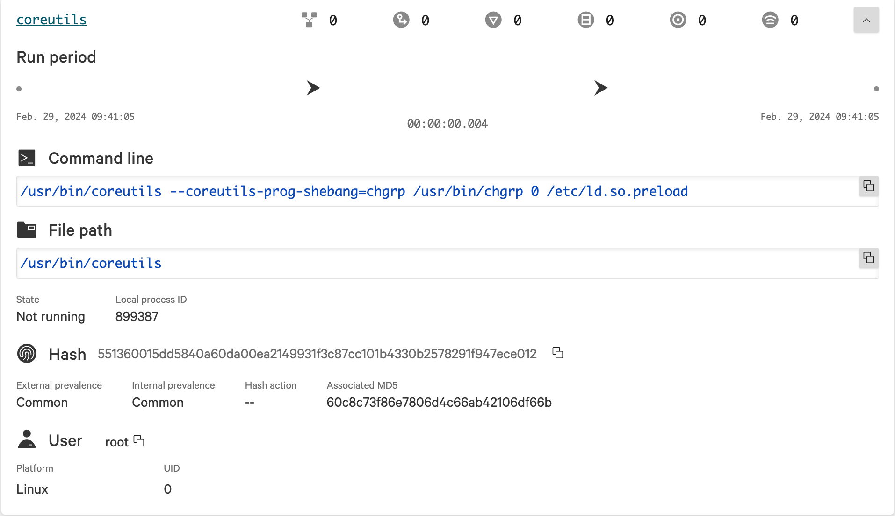

# Stopping Breaches on Red Hat OpenShift with the CrowdStrike Falcon Operator

By Rose Crisp & Evan Stoner

As Kubernetes becomes increasingly integral to production environments, cyber adversaries are likewise becoming more skilled in cloud-native exploitation. According to the [CrowdStrike 2024 Global Threat Report](https://www.crowdstrike.com/global-threat-report/), cases involving exploitation of cloud services increased by 110% in 2023, far outpacing non-cloud cases which grew at only 60%.

CrowdStrike helps organizations stay ahead of these evolving adversaries by providing breach prevention solutions that span endpoints, Kubernetes, clouds, data, and identity in its consolidated Falcon platform.

This blog will examine the follow:
- The CrowdStrike Falcon Platform architecture
- The CrowdStrike Falcon Platform Operator
- Installing the Openshift Certified Falcon Operator

### Falcon platform architecture

The CrowdStrike Falcon platform was designed to stop breaches and empower you. At a 10,000 foot view, CrowdStrike achieves this using a lightweight but powerful sensor that detects and prevents known and zero-day attacks, and a cloud-delivered platform that consolidates dozens of security capabilities and processes trillions of telemetry events every day. This means there's very little for administrators to manage. Specifically, for OpenShift, the Falcon platform offers runtime protection against advanced adversaries, and protects both container workloads and the CoreOS operating system.

Click [here](https://www.crowdstrike.com/resources/videos/machine-learning-falcon-sensor-provides-better-protection/) learn more about what makes the sensor so potent, and
[the difference between IOC's and IOA's](https://www.crowdstrike.com/cybersecurity-101/indicators-of-compromise/ioa-vs-ioc/).

### Why CrowdStrike developed an operator

Ease of deployment is a core tenet of CrowdStrike: the easier it is to deploy security software, the more likely an organization is to actually use it and be secure. In the Kubernetes ecosystem, _operators_ are the de facto packaging mechanism to simplify both the "day 1" deployment _and_ "day 2" maintenance of software.

CrowdStrike's Falcon operator automates these tasks during intial deployment:

- Get registry credentials from CrowdStrike API and create a corresponding registry `Secret`
- Create a `DaemonSet` for the Falcon sensor to be deployed to all nodes
- Optionally, deploy Falcon Admission Controller for cluster-level security

Plus, the operator performs these lifecycle tasks:

- Re-deploys the Falcon sensor when sensor configurations have changed
- Correlates your CrowdStrike Customer ID (CID) based on the provided CrowdStrike API credentials
- Re-deploys the Falcon Admission Controller when a change has occurred

In the future, the operator will be able to perform the following tasks:
- Ensure the certified operator is being installed when deploying on OpenShift
- Certificate renewal when cert-manger.io is deployed to manage cluster certificates

The operator streamlines a number of tasks, making it easier to maintain a consistent security posture across your Kubernetes fleet.

### Installation steps

#### Prerequisites

- [OpenShift 4.x Cluster](https://www.redhat.com/en/technologies/cloud-computing/openshift)
- Falcon Cloud Security subscription. Reach out to redhat@crowdstrike.com if you'd like to trial this. (Please use your company email address and provide background on the clusters you want to protect.)
#### Step 1: Create a CrowdStrike API client for the operator

1. Login to the Crowdstrike website.
2. Navigate to the **API Clients and Keys** page ( Support and resources > Resources and tools > API Clients and Keys ).
3. Click **Create API client**.
4. Enter details to define your API client:
- **Client Name**(Required)
- **Description** (optional)
- **API Scopes**(Required):
    - Select Falcon Images Download with read permission
    - Select Sensor Download with read permission 
5. Click Create to save the API client and generate the client ID and secret.

    

#### Step 2: Install CrowdStrike Falcon Operator from OperatorHub

1. Login to the Openshift Cluster.
2. Navigate to **Operators** > **OperatorHub**.
3. Search for "Falcon Operator" and select the tile offered by the Marketplace. Click "Install."
4. By default, the operator installs in the falcon-operator namespace. Continue with the default settings and click "Install."
5. On the screen, you will see a confirmation indicating that the operator is "ready for use."
6. Click on **View Operator** to proceed.

#### Step 3: Deploy FalconNodeSensor resource
The `FalconNodeSensor` resource manages the installation of the Falcon sensor on OpenShift control plane and worker nodes.

1. Navigate to **Installed Operators** > **CrowdStrike Falcon Platform - Operator**.
2. In the Falcon Node Sensor tile, select **Create instance**.
3. Choose the YAML view and fill in your `client_id` and `client_secret`. 
4. Fill in `namespace: falcon-operator`.
5. Click **Create**.
6. Wait until the Status updates to **Success**.
7. Switch to the **Workloads > DaemonSets** view and verify the `falcon-node-sensor` resource shows "X of X pods" (where X is the number of nodes in your cluster).

#### Step 4: Deploy the FalconAdmission resource
The `FalconAdmission` resource manages deployment of the Falcon Admission Controller on the cluster, which prevents noncompliant workloads from being deployed.

1. Navigate to **Installed Operators** > **CrowdStrike Falcon Platform - Operator**.
2. In the Falcon Admission tile, select **Create instance**.
3. Choose the YAML view and fill in your `client_id` and `client_secret`.
4. Click **Create**.
    - By default, Falcon Admission is deployed in the falcon-kac namespace. 
5. Select Project: falcon-kac.
6. Switch to the **Workloads** > **Pods** view and verify the 2 `falcon-admission-*` pods are running.

### Stop a simulated breach

To observe Falcon protection in action, install the `vulnapp` example vulnerable application. This application allows you to trigger malicious behavior inside of a container from a web browser. You can find the source for `vulnapp` [on GitHub](https://github.com/crowdstrike/vulnapp).

However, because the Falcon platform learns which applications are malicious, you may need to exclude the vulnerable application from monitoring to ensure it runs.

#### Step 1: Exclude the vulnerable application from detections
1. Login to Crowdstrike website.
2. In the Falcon console, navigate to **Endpoint security** > **Configure** > **Exclusions** 
3. Click **Create exclusion**
4. Select **All hosts** or follow the instructions to create a new group for the OpenShift nodes
5. Exclude from: Detections and preventions
6. Exclusion pattern: `/shell2http`
7. Click **Create exclusion**

#### Step 2: Install vulnerable testing application

Note that these steps expose `vulnapp` on a public route.

1. Create a new project for the application: `oc new-project vulnapp`
2. Deploy the application: `oc apply -f https://raw.githubusercontent.com/crowdstrike/vulnapp/main/vulnerable.openshift.yaml`
3. Retrieve the web address by running the following command:  `oc get route vulnapp`
4. Open the application using the web address, then select "/rootkit" to trigger a detection (This script will change the group owner of /etc/ld.so.preload to 0, indicative of a Jynx Rootkit)
5. In the Falcon console, navigate to **Endpoint security** > **Monitor** > **Endpoint detections** to view the detection
6. Select the **Severity** box on the left-hand side of the dashboard to view the details of the detection.
    - In the screenshot, you can see the `chgrp` command from `coreutils` being used to change the group ownership to 0 (root group) for the `/etc/ld.so.preload` file.
    

### Conclusion

You have successfully installed the CrowdStrike Falcon Platform Operator on your OpenShift 4.x cluster and deployed an example application to test detections.

Visit [crowdstrike.com/redhat](https://crowdstrike.com/redhat) to learn about all the ways CrowdStrike integrates with Red Hat Enterprise Linux, OpenShift, and Ansible.

