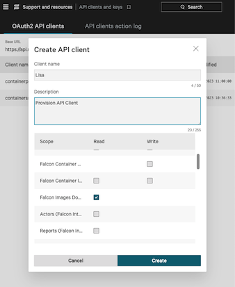

# Stopping Breaches on Red Hat OpenShift with the CrowdStrike Falcon Operator

By Rose Crisp & Evan Stoner

As Kubernetes becomes increasingly integral to production environments, cyber adversaries are likewise becoming more skilled in cloud-native exploitation. According to the [CrowdStrike 2024 Global Threat Report](https://www.crowdstrike.com/global-threat-report/), cases involving exploitation of cloud services increased by 110% in 2023, far outpacing non-cloud cases which grew at only 60%.

CrowdStrike helps organizations stay ahead of these evolving adversaries by providing breach prevention solutions that span endpoints, Kubernetes, clouds, data, and identity in its consolidated Falcon platform. Falcon leverages massive amounts of telemetry, expert knowledge of adversary tactics, and machine learning to detect and prevent malicious behavior before it can lead to a breach.

In this post, we'll dive deep into how the Falcon platform protects OpenShift clusters from advanced adversaries, why CrowdStrike developed a Kubernetes operator to simplify deployment, and how to install the certified operator in your OpenShift environment.

### Falcon platform architecture

The CrowdStrike Falcon platform was designed to stop breaches and empower the human operator. At a 10,000 foot view, CrowdStrike achieves this using a lightweight but powerful sensor that detects and prevents known and zero-day attacks, and a cloud-delivered platform that consolidates dozens of security capabilities and processes trillions of telemetry events every day. This means there's very little for administrators to manage.

So what makes the sensor so potent? Instead of relying solely on reactive _indicators of compromise_ (IOC's) such as malicious file hashes or blocked process names, the Falcon sensor proactively terminates _indicators of attack_ (IOA's): sequences of events that provide evidence of an attack in-progress. Taking a proactive approach allows organizations to stop attempted breaches before the adversary is successful. (You can read more about [the difference between IOC's and IOA's](https://www.crowdstrike.com/cybersecurity-101/indicators-of-compromise/ioa-vs-ioc/).)

### Why CrowdStrike developed an operator

Ease of deployment is a core tenet of CrowdStrike: the easier it is to deploy security software, the more likely an organization is to actually use it and be secure. In the Kubernetes ecosystem, _operators_ are the de facto packaging mechanism to simplify both the "day 1" deployment _and_ "day 2" maintenance of software.

CrowdStrike's Falcon operator automates these tasks during intial deployment:

- Get registry credentials from CrowdStrike API and create a corresponding registry `Secret`
- Create a `DaemonSet` for the Falcon sensor to be deployed to all nodes
- Optionally, deploy Falcon Admission Controller for cluster-level security

Plus, the operator performs these lifecycle tasks:

- Re-deploys the Falcon sensor when sensor configurations have changed
- Correlates your CrowdStrike Customer ID (CID) based on the provided CrowdStrike API credentials
- Re-deploys the Falcon Admission Controller when a change has occurred

In the future, the operator will be able to perform the following tasks:
- Ensure the certified operator is being installed when deploying on OpenShift
- Certificate renewal when cert-manger.io is deployed to manage cluster certificates

As you can see, the operator streamlines a number of tasks and thereby makes it easier to gain a consistent security posture across your Kubernetes fleet.

### Installation steps

Let's walk through the steps to install the CrowdStrike Falcon Platform Operator on your [OpenShift 4.x Cluster](https://www.redhat.com/en/technologies/cloud-computing/openshift) and deploy your first example application.

#### Prerequisites

- You'll need to be a CrowdStrike customer with a Falcon Cloud Security with Containers subscription to follow this guide. Reach out to redhat@crowdstrike.com if you'd like to trial this. (Please use your company email address and provide background on the clusters you want to protect.)
#### Step 1: Create a CrowdStrike API client for the operator
 

1. After logging to the CrowdStrike Falcon website at https://falcon.crowdstrike.com, navigate to the **API Clients and Keys** page ( Support and resources > Resources and tools > API Clients and Keys ), click Create API client.
2. Enter details to define your API client:
- Client Name (required)
- Description (optional)
- API Scopes (required):
    - Select Falcon Images Download with read permission
    - Select Sensor Download with read permission 
3. Click Create to save the API client and generate the client ID and secret.

    

#### Step 2: Install CrowdStrike Falcon Operator from OperatorHub

1. In your Openshift cluster, Navigate to **Operators** > **OperatorHub**.
2. Search for "Falcon Operator" and select the tile offered by the Marketplace. Click "Install."
3. The operator will, by default, be installed in the `falcon-operator` namespace. Proceed with the default configurations and select "**Install**."

    This installation process deploys three custom resources: `FalconAdmission`, `FalconNodeSensor`, and `FalconContainer`. (Note that `FalconContainer` is a sidecar sensor designed for managed Kubernetes services like AWS Fargate and is not intended for OpenShift at this time).
4. You will receive confirmation that the operator is "ready for use."
5. Click on View Operator to proceed.

#### Step 3: Deploy FalconNodeSensor resource
The `FalconNodeSensor` resource manages the installation of the Falcon sensor on OpenShift control plane and worker nodes, which provides protection to both container workloads and the underlying Red Hat CoreOS operating system.

1. Navigate to **Installed Operators** > **CrowdStrike Falcon Platform - Operator**.
2. In the Falcon Node Sensor tile, select "Create instance."
3. Choose the YAML view and fill in your `client_id` and `client_secret`. 
4. Fill in `namespace: falcon-operator`. Then, click "Create."
5. Wait until the Status updates to 'Success'.
6. Switch to the Workloads > DaemonSets view and verify the `falcon-node-sensor` resource shows "X of X pods" (where X is the number of nodes in your cluster).

#### Step 4: Deploy the FalconAdmission resource
The `FalconAdmission` resource manages deployment of the Falcon Admission Controller on the cluster, which prevents noncompliant workloads from being deployed.

1. Navigate to **Installed Operators** > **CrowdStrike Falcon Platform - Operator**.
2. In the Falcon Admission tile, select "Create instance."
3. Choose the YAML view and fill in your `client_id` and `client_secret`. Click "Create."
  **Note:** By default, Falcon Admission is deployed in the falcon-kac namespace. 
5. Select Project: falcon-kac.
6. Switch to the **Workloads** > **Pods** view and verify the 2 `falcon-admission-*` pods are running.

### Stop a simulated breach

To observe Falcon protection in action, install the `vulnapp` example vulnerable application. This application allows you to trigger malicious behavior inside of a container from a web browser. You can find the source for `vulnapp` [on GitHub](https://github.com/crowdstrike/vulnapp).

However, because the Falcon platform learns which applications are malicious, you may need to exclude the vulnerable application from monitoring to ensure it runs.

#### Step 1: Exclude the vulnerable application from detections

1. In the Falcon console, navigate to **Endpoint security** > **Configure** > **Exclusions** 
2. Click "Create exclusion"
3. Select "All hosts" or follow the instructions to create a new group for the OpenShift nodes
4. Exclude from: Detections and preventions
5. Exclusion pattern: `/shell2http`
6. Click "Create exclusion"

#### Step 2: Install vulnerable testing application

Note that these steps expose `vulnapp` on a public route.

1. Create a new project for the application: `oc new-project vulnapp`
1. Deploy the application: `oc apply -f https://raw.githubusercontent.com/crowdstrike/vulnapp/main/vulnerable.openshift.yaml`
2. Retrieve the web address by running the following command:  `oc get route vulnapp`
3. Open the application using the web address, then select "/rootkit" to trigger a detection (This script will change the group owner of /etc/ld.so.preload to 0, indicative of a Jynx Rootkit)
4. In the Falcon console, navigate to **Endpoint security** > **Monitor** > **Endpoint detections** to view the detection
5. Once there, select the **Severity** box on the left-hand side of the dashboard to view the details of the detection

    In the screenshot, you can see the `chgrp` command from `coreutils` being used to change the group ownership to 0 (root group) for the `/etc/ld.so.preload` file.

    

### Conclusion

By following these steps, you will have successfully installed the CrowdStrike Falcon Platform Operator on your OpenShift 4.x cluster and deployed an example application to test detections. The Falcon platform secures OpenShift by adding runtime protection from advanced adversaries, and protects both container workloads and the CoreOS operating system.

Visit [crowdstrike.com/redhat](https://crowdstrike.com/redhat) to learn about all the ways CrowdStrike integrates with Red Hat Enterprise Linux, OpenShift, and Ansible.

---

# Backup

### What is [CrowdStrike Falcon Platform](https://www.crowdstrike.com/)? 
CrowdStrike offers a range of cybersecurity products primarily focused on endpoint security, threat intelligence, and incident response. Their solutions leverage cloud-native architecture and artificial intelligence to provide real-time protection and monitoring.

The Falcon platform is their flagship product, providing comprehensive protection against a wide array of cyber threats. It integrates various security components like next-generation antivirus, endpoint detection and response (EDR), managed threat hunting, and IT hygiene.

### What is the [CrowdStrike Falcon Platform - Operator](https://github.com/CrowdStrike/falcon-operator/blob/main/README.md)?

The CrowdStrike Falcon Operator extends Kubernetes by installing custom resources, namely FalconAdmission and FalconNodeSensor. These additions simplify the deployment of Falcon sensors within the Kubernetes Cluster.

### What is an Operator?

An [operator](https://www.cncf.io/blog/2022/06/15/kubernetes-operators-what-are-they-some-examples/#:~:text=K8s%20Operators%20are%20controllers%20for,Custom%20Resource%20Definitions%20(CRD).) extends Kubernetes functionalities. It consists of three main parts: a controller, a custom resource, and application knowledge. Operators are responsible for managing the application lifecycle and can be configured to oversee all aspects of it.

Operators are especially useful for complex, stateful applications that need ongoing care. To create an operator, you start with a custom resource. The operator's controller continuously checks this resource, ensuring it matches the desired state defined in its YAML definition. This approach allows the operator to efficiently maintain the application from start to finish.

### What are the use cases for using the Falcon operator?

- **Endpoint Detection and Response:** CrowdStrike Falcon can be used for real-time monitoring and protection of endpoints against various cyber threats, including malware, ransomware, and sophisticated persistent threats. The platform's ability to detect and respond to incidents as they happen makes it a critical tool for organizations aiming to protect sensitive data and maintain business continuity.

- **Threat Intelligence and Analysis:** The Falcon platform can serve as a comprehensive threat intelligence tool. It can analyze vast amounts of data to identify emerging threats and provide actionable insights. This information can be crucial for organizations looking to understand the threat landscape, anticipate potential attacks, and strengthen their defenses accordingly.

- **Cloud Security and Compliance:** In environments where cloud infrastructure plays a pivotal role, CrowdStrike Falcon can be employed to secure cloud workloads and services. It can help ensure compliance with industry regulations and standards, monitor for misconfigurations and vulnerabilities, and provide overall security management for cloud-based resources.

### What are the benefits of using the Falcon operator?

- **Streamlined Deployment:** It automates and simplifies the deployment of CrowdStrike’s Falcon custom resources across Kubernetes clusters, reducing the complexity and manual effort involved in ensuring consistent security coverage.

- **Scalability:** The Operator is designed to seamlessly scale with your Kubernetes environment. It maintains its efficacy and performance regardless of the size and complexity of your clusters, ensuring that your expanding infrastructure remains secure.

- **Consistent Security Posture:** The Falcon Operator ensures uniform security implementation across all nodes and clusters in your Kubernetes environment, which is vital for maintaining a consistent and strong security stance.

- **Reduced Operational Overhead:** By abstracting the complexities involved in securing Kubernetes environments, the Falcon Operator reduces the operational burden on teams, enabling them to focus on other critical aspects of their infrastructure.

**Note:** The Falconcontainer resource is a sidecar sensor that is meant for kubernetes managed services like AWS fargate where you can’t install daemonsets…. and conflicts with the falconnodesensor kind